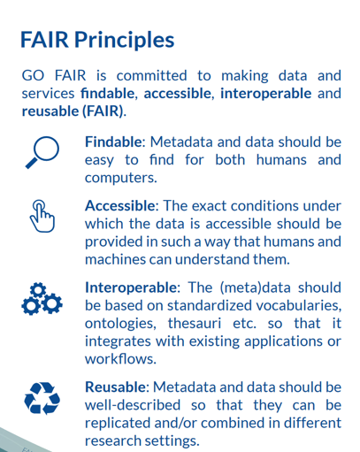

name: title
class: Left, middle


```{r setup, include=FALSE}
options(htmltools.dir.version = FALSE)
# knitr::opts_chunk$set(collapse = TRUE,
#                       fig.retina = 3)

knitr::opts_chunk$set(
  fig.width=9, fig.height=3.5, fig.retina=3,
  out.width = "100%",
  cache = FALSE,
  echo = TRUE,
  message = FALSE, 
  warning = FALSE,
  hiline = TRUE
)


```

```{r xaringan-extra, echo=FALSE}
library(xaringanExtra)

xaringanExtra:::use_xaringan_extra(c("tile_view", "panelset", "share_again", "editable"))

xaringanExtra::style_share_again(
  share_buttons = c("twitter", "linkedin", "pocket"))
xaringanExtra::use_scribble(
  pen_color = "#d33f49", pen_size = 4)
```


```{r xaringan-themer, include=FALSE, warning=FALSE}
source("xaringan-themer.R")
```

```{r, load_refs, include=FALSE, cache=FALSE}
source("load_references.r")
```


# `r rmarkdown::metadata$title`

### `r rmarkdown::metadata$subtitle`

.large[`r rmarkdown::metadata$description` &#183; `r rmarkdown::metadata$date`]

.right[`r rmarkdown::metadata$author` &#183; Sergi Trilles]

.right[`r rmarkdown::metadata$institute`]


---
class: inverse, bottom, middle

## Karl Pooper's *Conjectures and Refutations*

.large[The ideas we can most trust are those that have been the most tried and tested]

???

[Karl Popper](https://en.wikipedia.org/wiki/Karl_Popper)


---
name: rec11
class: inverse, center, middle

# .blue.bg-white[\#11]

# Open data != reproducible data

---
class: left
### Open data != reproducible


“Openness and Open Science (data sharing, code sharing, open access,
etc.) are enablers of reproducibility, but do not necessarily guarantee
it” https://zenodo.org/record/5521077

By default:

- Open != good (of high academic quality)
- Reproducible != Good (of high academic quality)
- Open != reproducible


---
name: rec12
class: inverse, center, middle

# .blue.bg-white[\#12]

# Data (required) for reproducibility


---
name: rec13
class: inverse, center, middle

# .blue.bg-white[\#13]

# Be (data) FAIR, my friend

---
class: left
### Be (data) FAIR, my friend 

.huge[[Findable, Accesible, Interoperable, Reusable](https://www.go-fair.org/fair-principles/) for scientific data management and stewardship]

-   .large[Emphasis on identifiers, metadata, standards, licenses, permanence `r cite("wilkinson2016")`]

-   .large[[How to GO FAIR](https://www.go-fair.org/how-to-go-fair/)]

-   .large[Data as **first-class citizen** in scientific discourse `r cite("noy2023")`]: Replication?

<br/>

.large[**[What UJI recommends...](http://www.uji.es/upo/rest/contenido/630998650/raw?idioma=es)**]

---
class: left
### Be (data) FAIR, my friend


.pull-left[

```{r fair, out.width ='75%', fig.align='center', echo=FALSE}

```

]

.pull-right[

.large[`r cite("pimentel2019")`  *`r title("pimentel2019")`*]

.large[They studied 1.4 millions of notebooks (GitHub)]

-   .large[Only 24% ran without exceptions] 
-   .large[Only 4% produced same results]

]


---
name: rec14
class: inverse, center, middle

# .blue.bg-white[\#14]

# Use open source software whenever possible

---
class: left
### Open source software


.pull-left[

.huge[Instead of ]

-   .large[ArcGIS]
-   .large[Google Maps/Places]
-   .large[Stata, SPSS, Excel...]

]

--

.pull-right[

.huge[Pick]
-   .large[QGIS]
-   .large[OpenStreetMap]
-   .large[Python, R, ...]

]


--

.huge[Mixed approach to make the .blue[implicit] (analytical workflow) .gray.bg-blue[explicit]]

-   .large[[ArcGIS Python Notebooks](https://developers.arcgis.com/python/guide/using-the-jupyter-notebook-environment/)]

???

make implicit explicit means to make analytical workflow explicit instead of click-based analysis 

---
name: rec15
class: inverse, center, middle

# .blue.bg-white[\#15]

# Learn/use scripting languages 

---
class: left
### Scripting languages 


.huge[Play with data, measure & explore, distrust of your intuition]


.huge[R/Python scripts describe every step of an analysis]

-   .large[Descriptive-based analysis (vs. click-based) of what the code does]

.huge[Others can understand (Remember: [_'Show me', not 'trust me'_](slides11_01.html#stark2018))]

-   .large[.gray.bg-blue[What] has been done & .gray.bg-blue[How] it has been done]

-   .large[See section *During analysis: best coding practices* `r cite("alston2021")`] 


---
name: rec16
class: inverse, center, middle

# .blue.bg-white[\#16]

# Learn/use computational notebook formats

---
class:left 
### Computational notebook formats

.huge[Computational notebook is a virtual notebook .gray.bg-blue[environment] used for .gray.bg-blue[literate programming], which consists of cells of .gray.bg-blue[documentation], executable .gray.bg-blue[code], and .gray.bg-blue[results] as code output ([Wikipedia](https://en.wikipedia.org/wiki/Notebook_interface))]

-   .large[Jupyter, RMarkdown, Quarto, Matlab,...]

--

.huge[Notebooks as first-class citizens] 

-   .large[EarthCube annual meetings include a call for notebooks ([CFN 22](https://www.earthcube.org/post/call-for-notebooks-cfn-22)) as peer-reviewed submissions - See [Notebooks 2022 proceedings](https://github.com/earthcube2022)]

-   .large[Master/PhD theses as computational notebooks?]

???

Also in my class of Spatial Data Science


---
name: rec17
class: inverse, center, middle

# .blue.bg-white[\#17]

# Preserve computational environment 


---
class:left
### Preserve computational environment

- `renv` package for R or `venv` for Python

- good for documenting specific versions of all packages being used in the project folder

- complement coding practices (setting a seed, etc.)


---
name: rec18
class: inverse, center, middle

# .blue.bg-white[\#18]

# Learn/use containerisation tools


---
class: left
### Containerisation tools


.pull-left[

.large[[Docker](https://www.docker.com/) and family tools `r cite("nust2020-docker")`]

.large[[Binder](https://mybinder.org/) deploys a cloud-based docker container based on a git repo]

.large[[`repo2docker`](https://github.com/jupyterhub/repo2docker) fetches a git repository and builds a container image based on the configuration files found in the repository]

]

.pull-right[


```{r nust2020-docker, out.width ='90%', fig.align='center', echo=FALSE}
knitr::include_graphics('https://journals.plos.org/ploscompbiol/article/figure/image?size=large&id=10.1371/journal.pcbi.1008316.g002
')
```

]


???

creating a snapshot of the computational environment

---
name: rec19
class: inverse, center, middle

# .blue.bg-white[\#19]

# Be (software) FAIR, my friend

---
class: left
### Be (software) FAIR, my friend

.huge[Document your source code `r cite(c("barker2022", "hasselbring2020"))`] 

-   .large[**Findable**: Deposit source code in a repository that provides DOIs and metadata]

-   .large[**Accessible**: Provide the opportunity to download the source code in bulk form]

-   .large[**Interoperable**: Use open source programming languages and software]

-   .large[**Reusable**: Release the software under a clear and open usage license]

--

.huge[Cite software properly `r cite("smith2016")` - [#2X](slides31_01.html)]


---
name: rec20
class: inverse, center, middle

# .blue.bg-white[\#20]

# Make use of *Make*


---
class: left
### Make use of *Make*

.huge[[GNU Make](https://www.gnu.org/software/make/) is +40 years old but still relevant today] 

-   .large[coordinates and automates command-line processes, such as a series of independent scripts]

-   .large[provides “one-entry” point to your analysis]

.huge[Readings]

-   .large[[Reproducibility with Make](https://the-turing-way.netlify.app/reproducible-research/make.html)]

-   .large[[SnakeMake](https://snakemake.readthedocs.io/en/stable/): Python alternative to Make]


---
name: summary
class: inverse, center, middle

# Summary

---

-    .large[[Open data != reproducible data](#rec11)]

-    .large[[Data (required) for reproducibility](#rec12)]

-    .large[[Be (data) FAIR, my friend](#rec13)]

-    .large[[Use open source software whenever possible](#rec14)]

-    .large[[Learn/use scripting languages](#rec15)]

-    .large[[Learn/use computational notebook formats](#rec16)]

-    .large[[Preserve computational environment](#rec17)]

-    .large[[Learn/use containerisation tools](#rec18)]

-    .large[[Be (software) FAIR, my friend](#rec19)]

-    .large[[Make use of *Make*](#rec20)]


---

# References

.tiny[
```{r print_refs1, echo=FALSE, results="asis"}
print(start = 1, end = 8)
```
]

