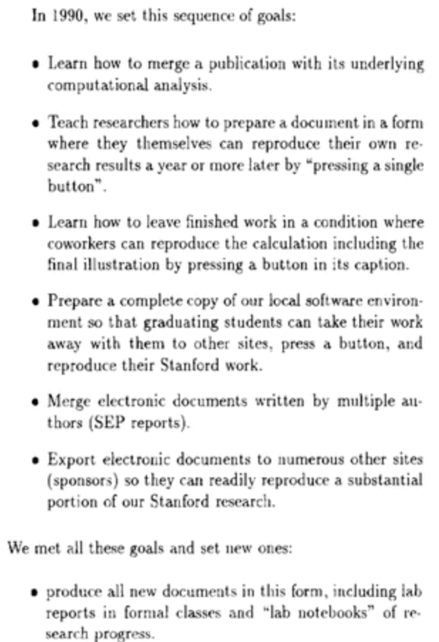

name: title
class: left, middle
<!--background-image: url(images/rawpixel/nasa-jupiter.jpg)
background-size: cover-->


```{r setup, include=FALSE}
options(htmltools.dir.version = FALSE)
# knitr::opts_chunk$set(collapse = TRUE,
#                       fig.retina = 3)

knitr::opts_chunk$set(
  fig.width=9, fig.height=3.5, fig.retina=3,
  out.width = "100%",
  cache = FALSE,
  echo = TRUE,
  message = FALSE, 
  warning = FALSE,
  hiline = TRUE
)


```

```{r xaringan-extra, echo=FALSE}
library(xaringanExtra)

xaringanExtra:::use_xaringan_extra(c("tile_view", "panelset", "share_again", "editable"))

xaringanExtra::style_share_again(
  share_buttons = c("twitter", "linkedin", "pocket"))
xaringanExtra::use_scribble(
  pen_color = "#d33f49", pen_size = 4)
```


```{r xaringan-themer, include=FALSE, warning=FALSE}
source("xaringan-themer.R")
```

```{r, load_refs, include=FALSE, cache=FALSE}
source("load_references.r")
```

# `r rmarkdown::metadata$title`

### `r rmarkdown::metadata$subtitle`

.large[`r rmarkdown::metadata$description` &#183; `r rmarkdown::metadata$date`]

.right[`r rmarkdown::metadata$author` &#183; Sergi Trilles]

.right[`r rmarkdown::metadata$institute`]

???

This enhanced color view of Jupiter's south pole was created using data from the JunoCam instrument on NASA's Juno spacecraft. Original from NASA.
Source: [Rawpixel](https://www.rawpixel.com/image/440596/jupiters-south-pole)

---
class: inverse, bottom, middle

## Focus is the art of knowing what to ignore.

.large[The fastest way to raise your level of performance: Cut your number of commitments in half.]

---
class: inverse, center, middle

# Reproducibility in Science

---
class: center
# Reproducibility in Science

.huge[Doubt is inherently human and we (scientists) always have doubts!]

--

.large[Well, that doesn’t mean it’s OK to keep questioning climate change, evolution, and the power of vaccines...]

---
class: center
# Advancing science and knowledge requires


--

.large[Openness]

--

.large[Transparency]

--

.large[Honesty]

--

.large[Reproduction]

--

.large[Cumulative evidence (replication)]

--

.huge.gray.bg-blue[It's all about the SCIENTIFIC METHOD!]

???

So, reproducibility is an integral part of the scientifc method. 

---
class: inverse, center, middle


# Is reproducibility a new problem?

---
class: center, middle

## .gray.bg-blue[Let's go back to the 17th century...]


---
class: center
# Huygens vs Boyle 

.pull-left[


[Christiaan Huygens](https://en.wikipedia.org/wiki/Christiaan_Huygens)

]

.pull-right[


[Robert Boyle](https://en.wikipedia.org/wiki/Robert_Boyle)

]


---
class: center, middle

.pull-left[

<br/><br/><br/><br/>

.huge[Boyle's [air-pump](https://en.wikipedia.org/wiki/Air_pump) was one of the first documented disputes over reproducibility adn the experiemental science...]

]


.pull-right[


]


---
class: center
# Huygens vs Boyle 

.pull-left[


.large[**Huygens** observed a new effect (*[anomalous suspension](https://www.youtube.com/watch?v=vekG7rotwy4)*) in NL]

]

--

.pull-right[


.large[**Boyle** could not replicate this effect in his own air pump in UK]

]

--

.huge[Huygens went to UK (1663) to personally help Boyle .gray.bg-blue[replicate] anomalous suspension of water]


???

[Source](https://en.wikipedia.org/wiki/Reproducibility)

Note here that non-replication can be good! Here, a new, valid effect during replication was not observed in the original study. That's how science progresses! 

---
class: center
# Newton vs Flamsteed

.pull-left[


[Isaac Newton](https://en.wikipedia.org/wiki/Isaac_Newton)
]

.pull-right[


[John Flamsteed](https://en.wikipedia.org/wiki/John_Flamsteed)

]


---
class: center, middle


.pull-left[

<br/><br/><br/><br/>

.huge[Flamsteed's [lunar data](https://articles.adsabs.harvard.edu//full/1995JHA....26..237K/0000237.000.html) & Newston's request for raw data...]

]


.pull-right[


]


???

[SAO/NASA Astrophysics Data System (ADS)](https://articles.adsabs.harvard.edu//full/1995JHA....26..237K/0000237.000.html)


---
class: center
# Newton vs Flamsteed


.large[In 1695, Sir Isaac Newton wrote a letter to the British Astronomer Royal John Flamsteed, whose data on lunar positions he was trying to get for more than half a year...]

--

.large[Newton wrote that...]

> .large[“these and all your communications will be useless to me unless you can propose some practicable way or other of supplying me with observations … .gray.bg-blue[I want not your calculations, but your observations only].”] `r cite("noy2019")`

<!--`r Cite(my_refs, "noy2019")`-->

???

[Kollerstrom, N. & Yallop, B. D. J. Hist. Astron. 26, 237–246 (1995)](https://doi.org/10.1177%2F002182869502600303).


---
class: inverse, center, middle

# Is reproducibility a new problem?


---
class: center, middle

## .gray.bg-blue[Let's go back to 40 years ago, with the birth of personal computers...]


---
class: left

# Literate programming 

.pull-left[

### [Essay = prose & code](http://www.literateprogramming.com/) `r cite("knuth1984")`

-   .large[Code embedded within the program's documentation as opposed to documentation embedded within code.]

-   .large[Combines .gray.bg-blue[programming language] (R, python) with .gray.bg-blue[documentation language] (TeX, LaTeX, Markdown).]

]

.pull-right[


[Donald E Knuth](https://en.wikipedia.org/wiki/Donald_Knuth)

]


---
# Dynamic documentation (Act III)

.large[.gray.bg-blue[constant change]: anytime that the underlying data, analysis, or code change, the report itself is automatically updated]

--

.pull-left[

.large[SWEAVE (2002) by Friedrich Leisch allowed R code to be embedded within lay LaTex documents]

]

--

.pull-right[

.large[Language-specific tools to enable interactive or “live” notebooks]: 

-   [Rmarkdown](https://rmarkdown.rstudio.com/)
-   [Jupyter Notebooks](https://jupyter.org/)
-   [Wolfram Notebooks](https://www.wolfram.com/notebooks/)

]


---
class: center, middle

# Is reproducibility a new problem?


---
class: center, middle

## .gray.bg-blue[Let's go back to 30 years ago, with the birth of Internet...]


---
class: center, middle

>  .huge[Today, few published results are reproducible in any practical sense. To verify them requires almost as much effort as it took to create them originally. 
After a time, authors are often unable to reproduce their own results! For these reasons, many people ignaore most of the literature. ]

.right[Jon Claerbout, *Earth Sounding Analysis*]

???

John Claerbout revised his book *Earth Soundings Analysis* with a valid complain.

---
class: left

# Electronic documents `r cite("claerbout1992")`


.pull-left[

-   .large[Merge publication with underlying computational analysis]

-   .large[Executable digital notebook]

-   .large[Be open & help others]

-   .large[Document for future self]
]

.pull-right[

]

---
class: center, middle

# Is reproducibility a new problem?

---
class: center, middle


## No, it is not .gray.bg-blue[NEW], but it .gray.bg-blue[IS] still a problem.

---
class: left, bottom
background-image: url(images/supertramp.jpg)
background-size: contain


---
class: left

### `r cite("alsheikhAli2011")` - _`r title("alsheikhAli2011")`_

.huge[Assessed 500 papers]

-   .large[149 not subject to any data availability policy]

-   .large[208 did not adhere to data availability instructions]

-   .large[143 adhered to minimum requirements]

-   .large[47 deposited full primary data] ~9%


---
class:left
### `r cite("baker2015")` - _`r title("baker2015")`_

.pull-left[

-   .large[Only 39 out ot 100 of the published studies in psychology could be reproduced.]

]

.pull-right[

```{r baker2015, out.width ='65%', echo=FALSE}
knitr::include_graphics('images/replicatation-graphic-b.png')
```
]


---
### .center[Reproducibility issues are well covered...]


-   .large[in __science studies__ in general, across various disciplines] `r cite("ioannidis2005")`: _`r title("ioannidis2005")`_

-   .large[in __economics__]: `r Cite(my_refs, "ioannidis2017")`: _`r title("ioannidis2017")`_

-   .large[in __medical chemistry__]: `r Cite(my_refs, "baker2017")`: _`r title("baker2017")`_

-   .large[in __neuroscience__]: `r Cite(my_refs, "button2013")`: _`r title("button2013")`_

-   others to CHECK


---
class: left

### `r cite("baker2016")` - _`r title("baker2016")`_


.pull-left[

-   .large[+70% of researchers have tried and failed to reproduce another scientist's experiments]

-   .large[+50% have failed to reproduce their own experiments]
]

.pull-right[

]

---
class: left
### `r cite("baker2016")` - Limitations & enablers 

.pull-left[

```{r baker2016_limitations, out.width ='65%', fig.align='center', echo=FALSE}
knitr::include_graphics('images/reproducibility-graphic-online4.jpg')
```

]

.pull-right[
```{r baker2016_enablers, out.width ='70%', fig.align='center', echo=FALSE}
knitr::include_graphics('images/reproducibility-graphic-online5.jpg')
```
]


---
class: left

### `r cite("fanelli2018")` -  _`r title("fanelli2018")`_

.huge[“science is in crisis” narrative is wrong?]

--

> The new “science is in crisis” narrative is not only empirically unsupported, but also quite obviously counterproductive. Instead of inspiring younger generations to do more and better science, it might foster in them cynicism and indifference. Instead of inviting greater respect for and investment in research, it risks discrediting the value of evidence and feeding antiscientific agendas.

---
class: left,

### `r cite("fanelli2018")` -  _`r title("fanelli2018")`_

.huge[“science is in crisis” narrative is wrong?]

> Therefore, contemporary science could be more accurately portrayed as facing “new opportunities and challenges” or even a “revolution”. .gray.bg-blue[Efforts to promote transparency and reproducibility would find complete justification in such a narrative of transformation and empowerment], a narrative that is not only more compelling and inspiring than that of a crisis, but also better supported by evidence.

---
class: inverse, center, middle

# The concept of reproduction 

---
class: left, center
# Objectives of scientific research

--

.huge[Discover laws, axioms, rules, etc. and describe them under which conditions they apply]

--

.huge[Conduct case studies to prove a general principle or theory]

--

.huge[Transfer/publish results to prove validity, veracity, trust in findings]

--

> One of the pathways by which scientists confirm the validity of a new
finding or discovery is by repeating the research that produced it.


> Observed inconsistency may be an important precursor to new discovery while 
others fear it may be a symptom of a lack of rigor in science


---
class: left

# .center[Today's reality]

-   .huge[.gray.bg-blue[Computation] has an increasing role in scientific research] `r cite("stodden2014")`

-   .huge[Many and diverse .gray.bg-blue[computational] sciences (bio-informatics, geophysics, material science, fluid mechanics, climate modelling, computational chemistry, ...)] `r cite("barba2021")`

-   .huge[if results are produced by complex .gray.bg-blue[computational] processes...] 

---
class: center. middle

## .gray.bg-blue[...the _methods_ section of a scientific paper is no longer sufficient]


---
class: left
### `r cite("nust2021")` - _The inverse problem_


---
class: left

### `r cite("stark2018")` - _'Show me', not 'trust me'_

.pull-left[

-   .large['Show me' = ‘help me if you can’]

> "If I say: ‘here’s my work’ and it’s wrong, I might have erred, but at least I am honest". 


-   .large[not 'trust me' = not ‘catch me if you can’]

> "If I publish a paper long on results but short on methods, and it’s wrong, that makes me untrustworthy." 

]

.pull-right[
```{r stark2018, out.width ='80%', fig.align='center', echo=FALSE}
knitr::include_graphics('images/preproducibility.png')
```
]


---
background-image: url(images/turingway_reproducibility.jpg)
background-size: contain

???

[The Turing Way Community](https://the-turing-way.netlify.app/reproducible-research/reproducible-research.html)

---
### `r cite("turingway2019")` - The Turing Way Community 

```{r turingway2019_matrix, out.width ='85%', fig.align='center', echo=FALSE}
knitr::include_graphics('images/turingway_reproducible-matrix.jpg')
```

???

[The Turing Way Community](https://the-turing-way.netlify.app/reproducible-research/overview/overview-definitions.html)

---
### .center[{Re}* terms ]

-   .large[__Reproducible research__: Authors provide all the necessary data and the computer codes to run the analysis again, re-creating the results.]

-   .large[__Reproducibility__: A study is reproducible if all of the code and data used to generate the numbers and figures in the paper are available and exactly produce the published results.]

-   .large[__Replication__: A study that arrives at the same scientific findings as another study, collecting new data (possibly with different methods) and completing new analyses.]


`r cite_footnote(c("claerbout1992", "donoho2009", "peng2011", "leek2017", "barba2018"))`


---
### .center[{Re}* terms ]


-   .large[__Replicability__: A study is replicable if an identical experiment can be performed like the first study and the statistical results are consistent.]

-   .large[__False discovery__: A study is a false discovery if the result presented in the study produces the wrong answer to the question of interest.]

`r cite_footnote(c("claerbout1992", "donoho2009", "peng2011", "leek2017", "barba2018"))`


---
class: center, middle

# Our view `r Cite(my_refs, c("ostermann2017", "nust2018", "ostermann2020"))`:

.large[A reproducible paper ensures a reviewer or reader can recreate the computational workflow of a study or experiment, including the prerequisite knowledge and the computational environment. The former implies the scientific argument to be understandable and sound. The latter requires a detailed description of used software and data, and both being openly available.]

---


-   .large[Computational reproducibility: When detailed information is provided about code, software, hardware and implementation details.]

-   .large[Empirical reproducibility: When detailed information is provided about non-computational empirical scientific experiments and observations. In practice, this is enabled by making the data and details of how it was collected freely available.]

-   .large[Statistical reproducibility: When detailed information is provided, for example, about the choice of statistical tests, model parameters, and threshold values. This mostly relates to pre-registration of study design to prevent p-value hacking and other manipulations.]

???

[The Turing Way Community](https://the-turing-way.netlify.app/reproducible-research/overview/overview-definitions.html)


---
class: center, middle

## We define .gray.bg-blue[reproducibility] to mean 

---
class: center, middle

## .gray.bg-blue[computacional reproducibility]


---
class: center

### `r cite("peng2011")` - _`r title("peng2011")`_

```{r peng2011, out.width ='90%', fig.align='center', echo=FALSE}
knitr::include_graphics('images/spectrumreproducibility.jpg')
```

---
class: inverse, center, middle

# Summary

---

### Reproducibility involves the .coldinline[ORIGINAL] data and code:
1. checking the published manuscript, 
1. looking for published data and code, then 
1. comparing the results of that data and code to the published results. 
1. if they are the same, the study is reproducible; otherwise, it is not.

---

### Replicability involves .fatinline[NEW] data collection to test for consistency with previous results of a smiliar study.

- Replication is to advance theory by confronting existing understanding with new evidence.`r Cite(my_refs, "nosek2020")` 
- Replication is accumulated  evidence 
- Even when paper is computationally reproducible, it may fail to be replicated


---

# References

.tiny[
```{r print_refs1, echo=FALSE, results="asis"}
print(start = 1, end = 15)
```
]

---

# References

.tiny[
```{r print_refs2, echo=FALSE, results="asis"}

print(start = 16, end = 24)
```
]

