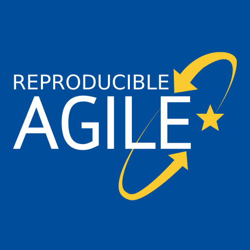

name: title
class: left, middle
<!--background-image: url(images/rawpixel/nasa-jupiter.jpg)
background-size: cover-->


```{r setup, include=FALSE}
options(htmltools.dir.version = FALSE)
# knitr::opts_chunk$set(collapse = TRUE,
#                       fig.retina = 3)

knitr::opts_chunk$set(
  fig.width=9, fig.height=3.5, fig.retina=3,
  out.width = "100%",
  cache = FALSE,
  echo = TRUE,
  message = FALSE, 
  warning = FALSE,
  hiline = TRUE
)


```

```{r xaringan-extra, echo=FALSE}
library(xaringanExtra)

xaringanExtra:::use_xaringan_extra(c("tile_view", "panelset", "share_again", "editable"))

xaringanExtra::style_share_again(
  share_buttons = c("twitter", "linkedin", "pocket"))
xaringanExtra::use_scribble(
  pen_color = "#d33f49", pen_size = 4)
```


```{r xaringan-themer, include=FALSE, warning=FALSE}
source("xaringan-themer.R")
```

```{r, load_refs, include=FALSE, cache=FALSE}
source("load_references.r")
```

# `r rmarkdown::metadata$title`

### `r rmarkdown::metadata$subtitle`

.large[`r rmarkdown::metadata$description` &#183; `r rmarkdown::metadata$date`]

.right[`r rmarkdown::metadata$author` &#183; Sergi Trilles]

.right[`r rmarkdown::metadata$institute`]

???

This enhanced color view of Jupiter's south pole was created using data from the JunoCam instrument on NASA's Juno spacecraft. Original from NASA.
Source: [Rawpixel](https://www.rawpixel.com/image/440596/jupiters-south-pole)

---
class: inverse, bottom, middle

## Focus is the art of knowing what to ignore.

.large[The fastest way to raise your level of performance: Cut your number of commitments in half.]

---
class: inverse, center, middle

# Reproducibility in Science

---
class: left
# Should we trust science?

.huge[Doubt is inherently human and we (scientists) also have doubts!]

--

.huge[Karl Pooper's *Conjectures and Refutations*]

> .large["At the core of the scientific method is the attempt to refute or disprove theories"]


???

By default, we (scientists) doubt everything.

[Karl Popper](https://en.wikipedia.org/wiki/Karl_Popper)


---
class: left

#  What is the scientific method?

.huge[Science progresses through *conjectures and refutations*]

--

-   .large[Scientists are confronted with some question, and offer a possible answer] 

--

-   .large[The  answer is a .gray.bg-blue[conjecture] initially (is it right or wrong?)]

--

-   .large[Scientists do their best to .gray.bg-blue[refute] this conjecture, or prove it wrong]

--

-   .large[Typically it is refuted, rejected, and replaced by a better one]

--

-   .large[This too will then be tested, and eventually replaced by an even better one]

--

-   .large[If scientists have not been able to refute a theory over a long period of time, despite their best efforts, then the theory has been .gray.bg-blue[corroborated]]


???

Source: [Why should we trust science? Because it doesn’t trust itself](https://theconversation.com/why-should-we-trust-science-because-it-doesnt-trust-itself-188988)


---
class: left

# Advancing science and knowledge...

--

.huge[... is all about the scientific method!]

-   .large[Openness, Transparency, Honesty, Integrity, Reproduction (test), Replication (cumulative evidence)]

--

.huge[For Pooper, the ideas we can most trust are those that have been the most .blue[tried and tested]]

--

.huge[So, .blue[reproduction & replication] are integral parts of the scientific method]

???

[Karl Popper](https://en.wikipedia.org/wiki/Karl_Popper)


---
class: inverse, center, middle


# Is reproducibility a new problem?

---
class: center, middle

## Let's go back to the .gray.bg-blue[ 17th century...]


---
class: center
# Huygens vs Boyle 

.pull-left[


[Christiaan Huygens](https://en.wikipedia.org/wiki/Christiaan_Huygens)

]

.pull-right[


[Robert Boyle](https://en.wikipedia.org/wiki/Robert_Boyle)

]


---
class: center, middle

.pull-left[

<br/><br/><br/><br/>

.huge[Boyle's [air-pump](https://en.wikipedia.org/wiki/Air_pump) was one of the first documented disputes over reproducibility and the experimental science...]

]


.pull-right[


]


---
class: center
# Huygens vs Boyle 

.pull-left[


.large[**Huygens** observed a new effect (*[anomalous suspension](https://www.youtube.com/watch?v=vekG7rotwy4)*) in NL]

]

--

.pull-right[


.large[**Boyle** could not replicate this effect in his own air pump in UK]

]

--

.huge[Huygens went to UK (1663) to personally help Boyle .gray.bg-blue[replicate] anomalous suspension of water]


???

[Source](https://en.wikipedia.org/wiki/Reproducibility)

Note here that non-replication can be good! Here, a new, valid effect during replication was not observed in the original study. That's how science progresses! 

---
class: center
# Newton vs Flamsteed

.pull-left[


[Isaac Newton](https://en.wikipedia.org/wiki/Isaac_Newton)
]

.pull-right[


[John Flamsteed](https://en.wikipedia.org/wiki/John_Flamsteed)

]


---
class: center, middle


.pull-left[

<br/><br/><br/><br/>

.huge[Flamsteed's [lunar data](https://articles.adsabs.harvard.edu//full/1995JHA....26..237K/0000237.000.html) & Newston's request for raw data...]

]


.pull-right[


]


???

[SAO/NASA Astrophysics Data System (ADS)](https://articles.adsabs.harvard.edu//full/1995JHA....26..237K/0000237.000.html)


---
name: newton
class: center
# Newton vs Flamsteed


.large[In 1695, Sir Isaac Newton wrote a letter to the British Astronomer Royal John Flamsteed, whose data on lunar positions he was trying to get for more than half a year...]

--

.large[Newton wrote that...]

> .large[“these and all your communications will be useless to me unless you can propose some practicable way or other of supplying me with observations … .gray.bg-blue[I want not your calculations, but your observations only].”] `r cite("noy2019")`


???

[Kollerstrom, N. & Yallop, B. D. J. Hist. Astron. 26, 237–246 (1995)](https://doi.org/10.1177%2F002182869502600303).


---
class: inverse, center, middle

# Is reproducibility a new problem?

---
class: center, middle

## Let's go back to the .gray.bg-blue[19th century]


---
class: left
# The case of Arman Fizeau 

.pull-left[

.center[


[Armand Fizeau](https://en.wikipedia.org/wiki/Hippolyte_Fizeau)]

]

.pull-right[

-   .large[Experimental physicist in Paris]

-   .large[His speciality was refining and confirming other people's results]

-   .large[This is the soul of science because there is no such thing as a fact that cannot be independently corroborated]


]

.center.huge[[How simple ideas lead to scientific discoveries](https://www.youtube.com/watch?v=F8UFGu2M2gM)]

---
class: inverse, center, middle

# Is reproducibility a new problem?

---
class: center, middle

## Let's go back to .gray.bg-blue[40 years ago], with the birth of personal computers...


---
class: left

# Literate programming `r cite("knuth1984")`

.pull-left[

.huge[[Prose & code together](http://www.literateprogramming.com/)] 

-   .large[Code embedded within the program's documentation as opposed to documentation embedded within code.]

-   .large[Combines .gray.bg-blue[programming language] (R, python) with .gray.bg-blue[documentation language] (TeX, LaTeX, Markdown).]

]

.pull-right[

```{r knuth, out.width ='60%', fig.align='center', echo=FALSE}
knitr::include_graphics('https://upload.wikimedia.org/wikipedia/commons/4/4f/KnuthAtOpenContentAlliance.jpg')
```

.center[[Donald E Knuth](https://en.wikipedia.org/wiki/Donald_Knuth)]

]


---
# Dynamic documentation (Act III)

.large[.gray.bg-blue[constant change]: anytime that the underlying data, analysis, or code change, the report itself is automatically updated]

--

.pull-left[

.large[SWEAVE (2002) by Friedrich Leisch allowed R code to be embedded within lay LaTex documents]

]

--

.pull-right[

.large[Language-specific tools to enable interactive or “live” notebooks]: 

-   [R Markdown](https://rmarkdown.rstudio.com/)
-   [Jupyter Notebooks](https://jupyter.org/)
-   [Wolfram Notebooks](https://www.wolfram.com/notebooks/)
-   [Google Colab](https://colab.research.google.com/)
-   [Quarto](https://quarto.org/): Python, R, Julia and Observable

]


---
class: inverse, center, middle

# Is reproducibility a new problem?


---
class: center, middle

## Let's go back to .gray.bg-blue[30 years ago], with the birth of the Web...


---
class: center, middle

>  .huge[Today, few published results are reproducible in any practical sense. To verify them requires almost as much effort as it took to create them originally. 
After a time, authors are often unable to reproduce their own results! For these reasons, many people ignore most of the literature. ]

.right[Jon Claerbout, *Earth Sounding Analysis*]

???

John Claerbout revised his book *Earth Soundings Analysis* with a valid complaint.

---
class: left

### `r cite("claerbout1992")` - _`r title("claerbout1992")`_


.pull-left[

-   .large[Merge publication with underlying computational analysis]

-   .large[Executable digital notebook]

-   .large[Be open & help others]

-   .large[Document for future self]
]

.pull-right[

```{r claerbout1992, out.width ='60%', fig.align='center', echo=FALSE}
knitr::include_graphics('images/Claerbout92.png')
```

]


---
class: inverse, center, middle

# Is reproducibility a new problem?


---
class: center, middle

## Let's go back to .gray.bg-blue[Sep 15, 2022]


---
class: left

### Facts

.large[Rubén Herzog, Universidad de Valparaíso in Chile, published a 2020 [article](https://www.nature.com/articles/s41598-020-74060-6) in Scientific Reports]

--

.large[Paul Lodder, a grad student at the University of Amsterdam, wanted to expand on the model used by Rubén]

--

.large[Paul reproduced the paper's analysis results before looking into expanding...and got .gray.bg-blue[different results]]


> I (Paul) shared my findings with Rubén by writing up a .gray.bg-blue[literate programming report], which allowed me to present my findings in a reproducible manner by including the code that leads to any of the results discussed.

> Because I (Paul) was able to run his code and mine on the same simulated data, it was very clear that the typo caused the results from the paper

???

Full story on [Retraction Watch](https://retractionwatch.com/):

- [A grad student finds a ‘typo’ in a psychedelic study’s script that leads to a retraction](https://retractionwatch.com/2022/10/06/a-grad-student-finds-a-typo-in-a-psychedelic-studys-script-that-leads-to-a-retraction/#more-125759)
- [‘A display of extreme academic integrity’: A grad student who found a key error praises the original author](https://retractionwatch.com/2022/10/11/a-display-of-extreme-academic-integrity-a-grad-student-who-found-a-key-error-praises-the-original-author/)


---
class: left

### Lessons

.huge[.gray.bg-blue[Academic integrity & honesty] through <br/> .gray.bg-blue[transparent and reproducible computational code]]

-   .large[Both collaborated to find out the typo]
-   .large[Paper is now retracted, but both are working in a new version of the paper]
-   .large[Science wins!]

???

Full story on [Retraction Watch](https://retractionwatch.com/):

- [A grad student finds a ‘typo’ in a psychedelic study’s script that leads to a retraction](https://retractionwatch.com/2022/10/06/a-grad-student-finds-a-typo-in-a-psychedelic-studys-script-that-leads-to-a-retraction/#more-125759)
- [‘A display of extreme academic integrity’: A grad student who found a key error praises the original author](https://retractionwatch.com/2022/10/11/a-display-of-extreme-academic-integrity-a-grad-student-who-found-a-key-error-praises-the-original-author/)


---
class: inverse, center, middle

# Is reproducibility a new problem?

---
class: center, middle


## No, it is not .gray.bg-blue[NEW], but it .gray.bg-blue[IS still a problem].

---
class: left, bottom
background-image: url(images/supertramp.jpg)
background-size: contain


---
class: left

### `r cite("alsheikhAli2011")` - _`r title("alsheikhAli2011")`_

.huge[Assessed 500 papers]

-   .large[149 did not subject to any data availability policy]

-   .large[208 did not adhere to data availability instructions]

-   .large[143 adhered to minimum requirements]

-   .large[47 deposited full primary data (~9%)] 


---
class:left
### `r cite("baker2015")` - _`r title("baker2015")`_

.pull-left[

-   .large[Only 39 out ot 100 of the published studies in psychology could be reproduced]

]

.pull-right[

```{r baker2015, out.width ='65%', echo=FALSE}
knitr::include_graphics('images/replicatation-graphic-b.png')
```
]


---
class: left
### Reproducibility issues are well covered...


-   .large[in __science studies__ in general, across various disciplines] `r cite("ioannidis2005")`: _`r title("ioannidis2005")`_

-   .large[in __economics__] `r cite("ioannidis2017")`: _`r title("ioannidis2017")`_

-   .large[in __medical chemistry__] `r cite("baker2017")`: _`r title("baker2017")`_

-   .large[in __neuroscience__] `r cite("button2013")`: _`r title("button2013")`_


---
class: left

### `r cite("baker2016")` - _`r title("baker2016")`_


.pull-left[

-   .large[+70% of researchers have tried and failed to reproduce another scientist's experiments]

-   .large[+50% have failed to reproduce their own experiments]
]

.pull-right[

]

---
class: left
### `r cite("baker2016")` - Limitations & enablers 

.pull-left[

```{r baker2016_limitations, out.width ='65%', fig.align='center', echo=FALSE}
knitr::include_graphics('images/reproducibility-graphic-online4.jpg')
```

]

.pull-right[
```{r baker2016_enablers, out.width ='70%', fig.align='center', echo=FALSE}
knitr::include_graphics('images/reproducibility-graphic-online5.jpg')
```
]


---
class: left

### `r cite("fanelli2018")` -  _`r title("fanelli2018")`_

.huge[Is “science is in crisis” narrative wrong?]

--

> .large[The new “science is in crisis” narrative is not only empirically unsupported, but also quite obviously counterproductive. Instead of inspiring younger generations to do more and better science, it might foster in them cynicism and indifference. Instead of inviting greater respect for and investment in research, it risks discrediting the value of evidence and feeding antiscientific agendas.]

---
class: left,

### `r cite("fanelli2018")` -  _`r title("fanelli2018")`_

.huge[“science is in crisis” narrative is wrong?]

> .large[Therefore, contemporary science could be more accurately portrayed as facing “new opportunities and challenges” or even a “revolution”. .gray.bg-blue[Efforts to promote transparency and reproducibility would find complete justification in such a narrative of transformation and empowerment], a narrative that is not only more compelling and inspiring than that of a crisis, but also better supported by evidence.]

---
class: inverse, center, middle

# The concept of reproduction 


---
class: left

# .center[Today's reality]

-   .huge[.gray.bg-blue[Computation] has an increasing role in scientific research] `r cite("stodden2014")`

-   .huge[Many and diverse .gray.bg-blue[computational] sciences (bio-informatics, geophysics, material science, fluid mechanics, climate modelling, computational chemistry, ...)] `r cite("barba2021")`

-   .huge[As results are increasingly produced by complex .gray.bg-blue[computational] processes...] 

---
class: center, middle

## ...the traditional .gray.bg-blue[methods] section <br/> of a scientific paper is <br/> .gray.bg-blue[no longer sufficient]


---
class: left

### `r cite("nust2021")` - _The inverse problem_


---
class: left

### `r cite("stark2018")` - _'Show me', not 'trust me'_

.pull-left[

-   .large['Show me' = help me if you can]

> "If I say: ‘here’s my work’ and it’s wrong, I might have erred, but at least I am honest". 


-   .large['Trust me' = catch me if you can]

> "If I publish a paper long on results but short on methods, and it’s wrong, that makes me untrustworthy." 

]

.pull-right[
```{r stark2018, out.width ='80%', fig.align='center', echo=FALSE}

```
]


---
background-image: url(images/turingway_reproducibility.jpg)
background-size: contain

???

[The Turing Way Community](https://the-turing-way.netlify.app/reproducible-research/reproducible-research.html)

---
name: matrix_definitions
### `r cite("turingway2019")` - The Turing Way Community 

```{r turingway2019_matrix, out.width ='85%', fig.align='center', echo=FALSE}
knitr::include_graphics('images/turingway_reproducible-matrix.jpg')
```

???

[The Turing Way Community](https://the-turing-way.netlify.app/reproducible-research/overview/overview-definitions.html)

---
### `r cite(c("claerbout1992", "donoho2009", "peng2011", "leek2017", "barba2018"))` - {Re}* terms

-   .large[__Reproducible research__: Authors provide all the necessary data and the computer codes to run the analysis again, re-creating the results.]

-   .large[__Reproducibility__: A study is reproducible if all of the code and data used to generate the numbers and figures in the paper are available and exactly produce the published results.]

-   .large[__Replication__: A study that arrives at the same scientific findings as another study, collecting new data (possibly with different methods) and completing new analyses.]


---
### `r cite(c("claerbout1992", "donoho2009", "peng2011", "leek2017", "barba2018"))` - {Re}* terms

-   .large[__Replicability__: A study is replicable if an identical experiment can be performed like the first study and the statistical results are consistent.]

-   .large[__False discovery__: A study is a false discovery if the result presented in the study produces the wrong answer to the question of interest.]


---
class: left

### `r cite(c("ostermann2017", "nust2018", "ostermann2021"))` - Our view

.pull-left[

> .large[A reproducible paper ensures a reader can recreate the computational workflow of a study, including the .gray.bg-blue[prerequisite knowledge] and the .gray.bg-blue[computational environment].] 

> - The former implies the scientific argument to be understandable and sound. 

> - The latter requires a detailed description of used software and data, and both being openly available.

]

.pull-right[

```{r reproducible-agile, out.width ='70%', fig.align='center', echo=FALSE}

```
.center[[Reproducible AGILE](https://reproducible-agile.github.io/)]

]


---
class: center, middle

## We define .gray.bg-blue[reproducibility] to mean 

---
class: center, middle

# .gray.bg-blue[computacional] reproducibility


---
class: center

### `r cite("peng2011")` - _`r title("peng2011")`_

```{r peng2011, out.width ='90%', fig.align='center', echo=FALSE}
knitr::include_graphics('images/spectrumreproducibility.jpg')
```

???

Linked to criteria assessment of reproducibility

---
class: left, middle

# Summary


.huge[Reproducibility involves the .gray.bg-blue[ORIGINAL] data and code]


.huge[Replicability involves .gray.bg-blue[NEW] data and/or methods]


---

# References

.tiny[
```{r print_refs1, echo=FALSE, results="asis"}
print(start = 1, end = 15)
```
]

---

# References

.tiny[
```{r print_refs2, echo=FALSE, results="asis"}

print(start = 16, end = 24)
```
]

