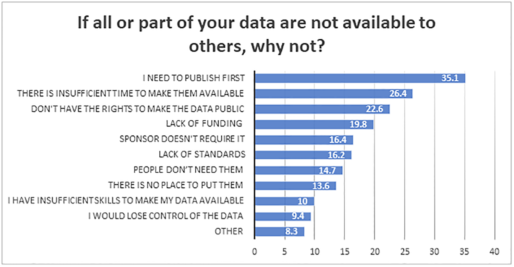

name: title
class: left, middle
<!--background-image: url(images/rawpixel/nasa-moon.jpg)
background-size: cover-->


```{r setup, include=FALSE}
options(htmltools.dir.version = FALSE)
# knitr::opts_chunk$set(collapse = TRUE,
#                       fig.retina = 3)

knitr::opts_chunk$set(
  fig.width=9, fig.height=3.5, fig.retina=3,
  out.width = "100%",
  cache = FALSE,
  echo = TRUE,
  message = FALSE, 
  warning = FALSE,
  hiline = TRUE
)

```

```{r xaringan-extra, echo=FALSE}
library(xaringanExtra)

xaringanExtra:::use_xaringan_extra(c("tile_view", "panelset", "share_again", "editable"))

xaringanExtra::style_share_again(
  share_buttons = c("twitter", "linkedin", "pocket"))
xaringanExtra::use_scribble(
  pen_color = "#d33f49", pen_size = 4)
```


```{r xaringan-themer, include=FALSE, warning=FALSE}
source("xaringan-themer.R")
```

```{r, load_refs, include=FALSE, cache=FALSE}
source("load_references.r")
```

# `r rmarkdown::metadata$title`

### `r rmarkdown::metadata$subtitle`

.large[`r rmarkdown::metadata$description` &#183; `r rmarkdown::metadata$date`]

.right[`r rmarkdown::metadata$author` &#183; Sergi Trilles]

.right[`r rmarkdown::metadata$institute`]


???

Moon - north polar mosaic. Original from NASA.
Source: [Rawpixel](https://www.rawpixel.com/image/441553/north-polar-the-moon)


---
class: inverse, bottom, middle

## You can't guarantee success,

.large[but you can guarantee failure: never try.]


---
class: left, center
# Objectives of scientific research

--

.huge[Discover laws, axioms, rules, etc. and describe under which conditions they apply]

--

.huge[Conduct case studies to prove a general principle or theory]

--

.huge[Transfer/publish results to prove validity, veracity, trust in findings]

--

> One of the pathways by which scientists confirm the validity of a new
finding or discovery is by repeating the research that produced it.


> Observed inconsistency may be an important precursor to new discovery while 
others fear it may be a symptom of a lack of rigor in science


---

# Reproducibility involves the .gray.bg-blue[ORIGINAL] data and code

-   .large[check the published manuscript,]

-   .large[look for published data and code, then]

-   .large[compare the results of that data and code to the published results]

-   .large[if they are the same, the study is reproducible; otherwise, it is not]

---

# Replicability involves .gray.bg-blue[NEW] data collection and/or methods

-   .large[Replication is to test for consistency with previous results of a similar study]

-   .large[Replication is to advance theory by confronting existing understanding with new evidence] `r cite("nosek2020")` 

-   .large[Replication is accumulated evidence] (way to plan a PhD project?)

-   .large[Even when a paper is computationally reproducible, it *may fail* to be replicated]


---
class: inverse, center, middle

# What does research mean for a PhD thesis today?


---
background-image: url(http://www.phdcomics.com/comics/archive/phd073010s.gif)
background-size: contain

???
[phdcomics.com](https://phdcomics.com/comics/archive.php?comicid=1350)


---
background-image: url(images/turingway_reproducibility.jpg)
background-size: contain


???

[The Turing Way Community](https://the-turing-way.netlify.app/reproducible-research/reproducible-research.html)


---
class: left 

### `r cite("chiarelli2021")` - _`r title("chiarelli2021")`_

> .huge[Openness and Open Science (data sharing, code sharing, open access, etc.) are .gray.bg-blue[enablers of reproducibility], but do .gray.bg-blue[not necessarily guarantee it]]

--

.pull-left[

.center[.large[sharing research outputs]]

.center[paper + underpinning data, code, and detailed documented methodology]

]

--

.pull-right[

.center[.large[reproduce/replicate findings]]

.center[evaluate and testing results outputs, which have to be openly published (above) but also clearly separated, labelled and documented]
]


---
class: left
# Data...

--

.huge[Do your colleagues in your discipline .gray.bg-blue[share] data?]

--

.huge[Do you .gray.bg-blue[access/use] other's data for your research?]

--

.huge[Do you .gray.bg-blue[share] all, part or none of your data?]

--

.huge[Would you like to .gray.bg-blue[share] (more) data?]

--

.huge[Is your data collection/storage/processing dependent on .gray.bg-blue[computation]? How much?] 


---
class: left
### Data sharing in academia

.huge[Sequel of _Tenopir and colleagues_]

.large[`r cite("tenopir2011")`: _`r title("tenopir2011")`_]

.large[`r cite("tenopir2015")`: _`r title("tenopir2015")`_]

.large[`r cite("tenopir2020")`: _`r title("tenopir2020")`_]


---
class: left

### `r cite("tenopir2020")` - Disciplines 

```{r tenopir2020_disciplines, out.width ='65%', fig.align='center', echo=FALSE}
knitr::include_graphics('images/tenopir2020_fig07.png')
```


---
class: left

### `r cite("tenopir2020")` - Barriers 


```{r tenopir2020_barriers, out.width ='85%', fig.align='center', echo=FALSE}

```


---
class: left
# Methods, tools, code...results

.huge[Is your research linked to .gray.bg-blue[quantitative] or .gray.bg-blue[qualitative methods]? .gray.bg-blue[Mixed] approach?]

--

.huge[Do your methods depend on .gray.bg-blue[computation]? How much?]

--

.huge[Which computational tools do you use? Sporadically or frequently? Are general-purpose (Word) or specific (SSPS) tools?]

--

.huge[In which phases* do you use them?]

.right[*modelling, data analysis, data visualisation, writing, dissemination/presentation, communication, ...]


---
class: inverse, center, middle

# What do reproducibility & openness mean for a PhD thesis?


---
class: center, middle

## .gray.bg-blue[drivers and perceived benefits]

---
class: left
### `r cite("markowetz2015")` - `r title("markowetz2015")`


-   .large[personal belief] as reproducible work is fundamental to academic research

-   .large[helps to avoid disaster] by tracking a complete history of your research

-   .large[makes it easier to write papers/theses] though well-documented analyses for generating results that keep your paper bug-free

-   .large[helps reviewers see it your way] by inspecting the different parts of the project

-   .large[enables continuity of your work] by enabling others to build on your results

-   .large[helps to build your reputation] as your research outcomes can be broadly replicated, trusted and get cited

-   .large[you learn some new science]


---
class: center, middle

## .gray.bg-blue[potencial barriers]


---
class: left
### `r cite(c("turingway2019", "chiarelli2021"))`


-   .large[is perceived as technically hard]

-   .large[training and mentoring are limited]

-   .large[unwilling to share data] by fear of getting scooped, misused

-   .large[data/code are not "good enough"] to be openly available and judged by others

-   .large[all this effort is not considered for promotion]

-   .large[metrics focus on quantity and impact factor] rather than on quality and reproducibility


---
class: inverse, center, middle


# What's your choice?

---
class: center, bottom
background-image: url(images/rawpixel/clouds-nebraska.jpg)
background-size: cover


## .white[Business as usual scenario and irreproducible work remains the norm] `r cite("hong2015")`


---
class: center, middle
background-image: url(images/rawpixel/beach.jpg)
background-size: cover


## Or you care about .gray.bg-blue[reproducibility] and .gray.bg-blue[openness], and you are excited to acquire new reproducible research practices and habits! 


---
class: inverse, center, middle

# Assessment criteria for (pre-)reproducibility


---
background-image: url(images/AGILE04.png)
background-size: contain
class: left, top

.large[`r cite(c("nust2018", "ostermann2021"))`]


---

# References

.tiny[
```{r print_refs1, echo=FALSE, results="asis"}
print(start = 1, end = 8)
```
]