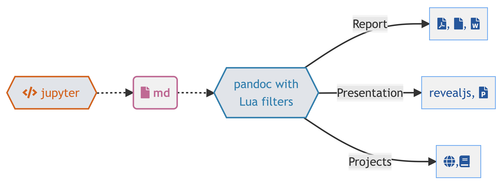

name: title
class: Left, middle


```{r setup, include=FALSE}
options(htmltools.dir.version = FALSE)
# knitr::opts_chunk$set(collapse = TRUE,
#                       fig.retina = 3)

knitr::opts_chunk$set(
  fig.width=9, fig.height=3.5, fig.retina=3,
  out.width = "100%",
  cache = FALSE,
  echo = TRUE,
  message = FALSE, 
  warning = FALSE,
  hiline = TRUE
)


```

```{r xaringan-extra, echo=FALSE}
library(xaringanExtra)

xaringanExtra:::use_xaringan_extra(c("tile_view", "panelset", "share_again", "editable"))

xaringanExtra::style_share_again(
  share_buttons = c("twitter", "linkedin", "pocket"))
xaringanExtra::use_scribble(
  pen_color = "#d33f49", pen_size = 4)
```


```{r xaringan-themer, include=FALSE, warning=FALSE}
source("xaringan-themer.R")
```

```{r, load_refs, include=FALSE, cache=FALSE}
source("load_references.r")
```


```{r load, echo=FALSE}
library(report)
```

# `r rmarkdown::metadata$title`

### `r rmarkdown::metadata$subtitle`

.large[`r rmarkdown::metadata$description` &#183; `r rmarkdown::metadata$date`]

.right[`r rmarkdown::metadata$author` &#183; Sergi Trilles]

.right[`r rmarkdown::metadata$institute`]


---
class: inverse, bottom, middle

## Nobel laureate and physics professor Wolfgang Pauli

.large["I do not mind if you think slowly, but I do object when you publish more quickly than you think.”]

???

[Wolfgang Pauli](https://es.wikipedia.org/wiki/Wolfgang_Pauli), [Quotes](https://en.wikiquote.org/wiki/Wolfgang_Pauli)

---
name: rec21
class: inverse, center, middle

# .blue.bg-white[\#21]

# Avoid *Data (or code) available upon request*

---
class: left
### Data (or code) available upon request

.huge[`r cite("stodden2018")` -  `r title("stodden2018")`]

.large[...only .gray.bg-blue[44%] of requests led to receiving data and/or code from the original authors]


---
name: rec22
class: inverse, center, middle

# .blue.bg-white[\#22]

# Report the software version you use

---
class: left, top
### Software version

.huge[Specify versions of relevant software components (packages, libraries)]

.huge[A different version can lead to different results!]

.large[`r cite("mesnard2017")` - `r title("mesnard2017")`]

-   .large[Check "Story 4: Different Versions of Code, External Libraries, or Compilers can Challenge Reproducibility"]

---
name: rec23
class: inverse, center, middle

# .blue.bg-white[\#23]

# Cite the software you use


---
class: left
### Software citation

.huge[Cite software that's important to the research outcome]

-   .large[[R engine](https://ropensci.org/blog/2021/11/16/how-to-cite-r-and-r-packages/)?] 

  - type  `citation()` to get reference publication in bibtex entry
  - add "All analyses were performed using R Statistical Software (v4.2.2; R Core Team 2022)" to **DASA section**

-   .large[[R packages](https://ropensci.org/blog/2021/11/16/how-to-cite-r-and-r-packages/)? It depends...]

  - type `citation("<packageName>")` to get reference publication in bibtex format 
  - add "Temperature data was obtained from Environment and Climate Change Canada via the `weathercan` R package (v0.6.2; LaZerte and Albers 2018)" to **DASA section**.


---
class: left
### Software citation

.huge[[`report`](https://cran.r-project.org/package=report) R Package]

```{r}
report::report_system()
```

```{r}
report::report_packages()
```


---
class: left
### Software citation

.pull-left[

.huge[Do not use URL to cite external library/code/software]

-   .large[Cite `SciPy` as a footnote: https://scipy.org/?]

]

--

.pull-right[

.huge[Cite software as any other paper instead] 

-   .large[Cite `SciPy` as a paper: [Virtanen et al. (2020)](https://scholar.google.com/scholar?hl=en&as_sdt=0%2C5&q=SciPy+1.0%3A+fundamental+algorithms+for+scientific+computing+in+Python&btnG=)?]

]

--

.huge[Readings:]

-   .large[[Software Citation Checklist for Authors](https://zenodo.org/record/3479199#.YYmfT73MKAk)]

-   .large[`r title("smith2016")` `r cite("smith2016")`]


---
name: rec24
class: inverse, center, middle

# .blue.bg-white[\#24]

# Hello Quarto (and friends)

---
class: left
### Hello Quarto (and friends)


.huge[You can weave together narrative text and code to produce elegantly formatted output as documents, web pages, blog posts, books and more]

.huge[Truly reproducible figures and tables are created directly with code and integrated into documents in a way that allows automatic updating when analyses are re-run, creating a “dynamic” document]

.huge[[Quarto in 2 hours](https://jthomasmock.github.io/quarto-2hr-webinar/materials/01-intro-quarto.html)]

---
class: left
### Hello Quarto (and friends)

.huge[`knitr` started in 2011, RMarkdown in 2014]


---
class: left
### Hello Quarto (and friends)

.huge[`Quarto` started in 2022]


---
class: left
### Hello Quarto (and friends)

.huge[`Quarto` started in 2022]


---
class: left
### Hello Quarto (and friends)





???

Quarto uses an engine like `knitr` to execute code and generate a temporary output `.md`

The `.md` file is processed via Pandoc and Quarto's Lua filters + Bootstrap CSS for HTML or LaTeX for PDF and converted to a final output format

Lua filters written by R/Python/Julia developers should be interchangeable between formats - typically not language specific!


---
name: rec25
class: inverse, center, middle

# .blue.bg-white[\#25]

# Pre-print your work 

---
class: left
### Pre-print your works


.huge[**Preprints** are versions of your paper that have not yet been sent to a journal for review]

-   .large[Choose the most appropriate copyright license for your work]

-   .large[Increase access and visibility to (pre-acceptance) versions of manuscripts] 

.huge[Where to publish a preprint paper?]

-   .large[[arXiv](https://arxiv.org/), [BioRxiv](https://www.biorxiv.org/), [ChemRxiv](https://chemrxiv.org/engage/chemrxiv/public-dashboard), [EarthArXiv](https://eartharxiv.org/), [psyArXiv](https://psyarxiv.com/), [SocArXiv](https://osf.io/preprints/socarxiv)]

---
class: left
### Pre-print your works

.huge[**[What UJI recommends...](https://www.uji.es/serveis/cd/bib/serveis/investigacio/oa/)**] 

> *Guardar siempre la última versión del artículo que se ha enviado en la revista después del proceso de peer review (esta versión recibe nombres diferentes: postprint author's final draft; accepted author manuscript; accepted version, postprint, etc.), puesto que algunas editoriales solo permiten publicar esta versión en los repositorios institucionales. Esta versión, y la versión definitiva publicada, cumplen los mandatos de la Ley de la ciencia y Horizonte Europa.*

> *¿Qué se tiene que depositar en acceso abierto? Obligatoriamente, artículos de revistas científicas.*

> *Se depositará la versión postprint, es decir, el manuscrito revisado y aceptado para su publicación, antes de las adaptaciones al formato final del editor, o la versión preprint.*

???

- [arXiv](https://arxiv.org/): physics, mathematics, computer science, quantitative biology, statistics, electrical engineering, and system sciences.
- [BioRxiv](https://www.biorxiv.org/): biological sciences.
- [ChemRxiv](https://chemrxiv.org/engage/chemrxiv/public-dashboard): chemical science.
- [EarthArXiv](https://eartharxiv.org/)]: Earth Science and related domains of planetary science
- [psyArXiv](https://psyarxiv.com/): psychology, powered by [OSFPreprints](https://osf.io/preprints/).
- [SocArXiv](https://osf.io/preprints/socarxiv): social sciences, powered by [OSFPreprints](https://osf.io/preprints/).

---
name: rec26:
class: inverse, center, middle

# .blue.bg-white[\#26]

# Research Compendia

---
class: left
### Research Compendia

.huge[Data, code, software, and products of a research project are archived together]

.huge[Standardized and easily recognizable way to organize digital materials of a research project]

.huge[Tools to share every step of the scientific process]

  -   .large[[Open Science Framework (OSF)](http://osf.io/) [Getting started on the OSF](https://help.osf.io/article/342-getting-started-on-the-osf)]

  -   .large[[Octopus](https://www.octopus.ac/) `r cite("dhar2023")`]
  
  -   .large[[ResearchEquals](https://www.researchequals.com/) `r cite("dhar2023")`]


---
name: rec27
class: inverse, center, middle

# .blue.bg-white[\#26]

# Interactive papers


---
class: left
### Interactive papers


.huge[Reproducible entire analysis...]

-   .large[remote execution via Binder, Google Colab, ...]

-   .large[local execution via Docker or `renv`]

--

.huge[What if interested in a small fraction of an analysis]

--

-   .large[protected computing environment (sandbox) + notebooks + `learnr` R package `r cite("aden-buie2023")`]

-   .large[Ex: [GB rainfall chemistry paper](https://cptecn-sandboxdemo.datalabs.ceh.ac.uk/) `r cite("tso2022")`]


---
name: summary
class: inverse, center, middle

# Summary

---

-    .large[[Avoid *Data (or code) available upon request*](#rec21)]

-    .large[[Report the software version you use](#rec22)]

-    .large[[Cite the software you use](#rec23)]

-    .large[[Hello Quarto (and friends)](#rec24)]

-    .large[[Pre-print your work](#rec25)]

-    .large[[Research Compendia](#rec26)]

-    .large[[Interactive papers](#rec27)]


---

# References

.tiny[
```{r print_refs1, echo=FALSE, results="asis"}
print(start = 1, end = 6)
```
]

